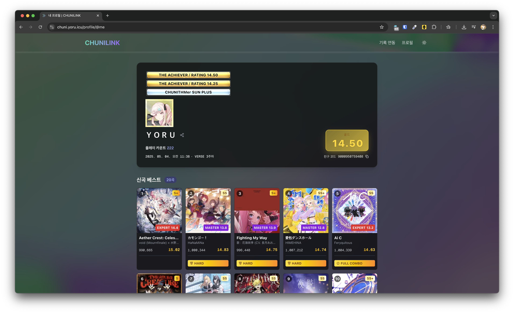
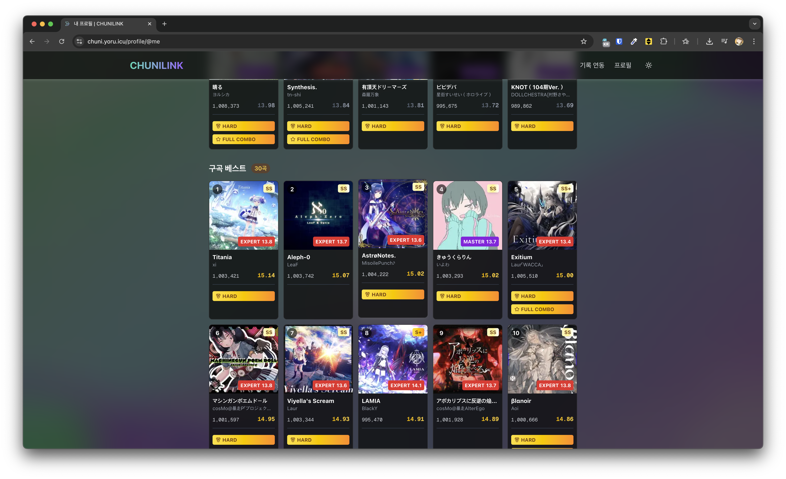

# 츄니링크

> https://maimai.shiftpsh.com 의 츄니즘 version을 만들어 보고싶다는 생각이 들었습니다


## 소개

츄니링크는 Chunithm의 비공식 성과 공유 사이트로, SEGA® 저작권의 관련이 없습니다. 개인 성과 추적 및 공유를 위한 팬 프로젝트 입니다.

## 스크린샷

<table>
  <tr>
    <td align="center">
      <br/>
    </td>
    <td align="center">
      <br/>
    </td>
  </tr>
  <tr>
    <td colspan="2" align="center">
      <br/>
    </td>
  </tr>
</table>


## 설치 및 실행 방법

```bash
# 저장소 클론
git clone https://github.com/yourusername/chunilink.git

# 디렉토리 이동
cd chunilink

# 의존성 설치
yarn install

# 개발 서버 실행
yarn dev
```

## 면책 조항

본 서비스는 SEGA® 또는 CHUNITHM과 공식적인 관련이 없는 팬 프로젝트입니다.

